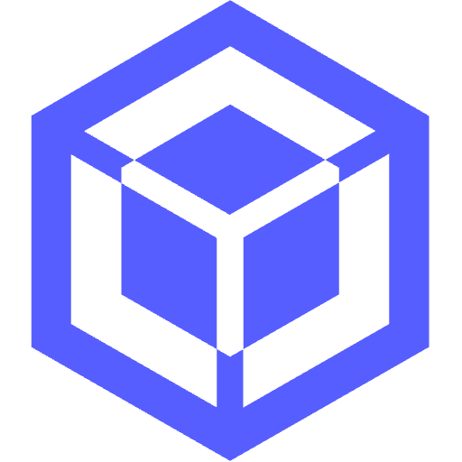

# AppsAI MCP Server

[](https://www.npmjs.com/package/@appsai/mcp-server)
[](https://registry.modelcontextprotocol.io/servers/com.appsai/mcp-server)
[](https://opensource.org/licenses/MIT)

<p align="center">
  
</p>

Build and deploy full-stack Next.js applications through natural language. Connect Claude Code and other MCP-compatible tools to your AppsAI projects.

## Quick Start

### 1. Get an API Key

1. Sign up at [appsai.com](https://appsai.com)
2. Go to **Settings → Billing → API Keys**
3. Click **Create Key** and copy it (shown only once)

### 2. Add to Claude Code

```bash
claude mcp add appsai --env APPSAI_API_KEY=your_key_here -- npx @appsai/mcp-server
```

### 3. Start Building

```
"List my projects"
"Create a new project using the nextjs-starter template"
"Show the element tree for app/page.tsx in project abc123"
"Add a hero section with a gradient background"
"Deploy the frontend"
```

## Features

- **98 Tools** across 8 categories for full-stack development
- **One-command deployment** to AWS CloudFront + Lambda
- **React/Next.js** frontend development with visual component editing
- **Parse Server** backend with cloud functions
- **AWS Infrastructure** via CloudFormation
- **MongoDB Atlas** database management
- **Pay-as-you-go** billing using your AppsAI credit balance

## Tool Categories

| Category | Tools | Description |
|----------|-------|-------------|
| **Project** | 5 | Create, list, delete, get project details |
| **Canvas** | 25 | Frontend React/Next.js development |
| **Server** | 6 | Backend Parse Server cloud functions |
| **System** | 5 | Deployment & environment management |
| **AWS** | 23 | CloudFormation, S3, Lambda, CloudWatch |
| **MongoDB** | 18 | Clusters, databases, collections, queries |
| **Agent** | 9 | AI prompt management |
| **Shared** | 7 | Cross-category communication |

## Example Workflows

### Create and Deploy a New App

```
1. "What templates are available?"
2. "Create a new project using the nextjs-starter template"
3. "Add a landing page with a hero section and feature grid"
4. "Deploy the frontend"
```

### Modify an Existing Project

```
1. "List my projects"
2. "Show the files in project happy-purple-fox"
3. "Update the navbar to include a login button"
4. "Deploy all"
```

### Database Operations

```
1. "Create a MongoDB collection called 'users' in project abc123"
2. "Add an index on the email field"
3. "Query all users created in the last 7 days"
```

## Environment Variables

| Variable | Required | Description |
|----------|----------|-------------|
| `APPSAI_API_KEY` | Yes | Your API key from Settings → Billing → API Keys |

## Billing

Usage is charged to your AppsAI credit balance:

| Operation | Cost |
|-----------|------|
| File read/write | Free |
| AI generation | Model-based pricing |
| AWS operations | Based on resources |
| MongoDB | Based on cluster tier |
| Deployment | Per deployment |

View usage at [appsai.com/editor/settings](https://appsai.com/editor/settings) → Billing → Credit History.

## Documentation

- [Quick Start Guide](https://appsai.com/docs/mcp/quickstart)
- [Authentication](https://appsai.com/docs/mcp/authentication)
- [Tools Reference](https://appsai.com/docs/mcp/tools)
- [Billing & Usage](https://appsai.com/docs/mcp/billing)

## Links

- [Website](https://appsai.com)
- [Documentation](https://appsai.com/docs/mcp)
- [npm Package](https://www.npmjs.com/package/@appsai/mcp-server)
- [MCP Registry](https://registry.modelcontextprotocol.io/servers/com.appsai/mcp-server)

## License

MIT
